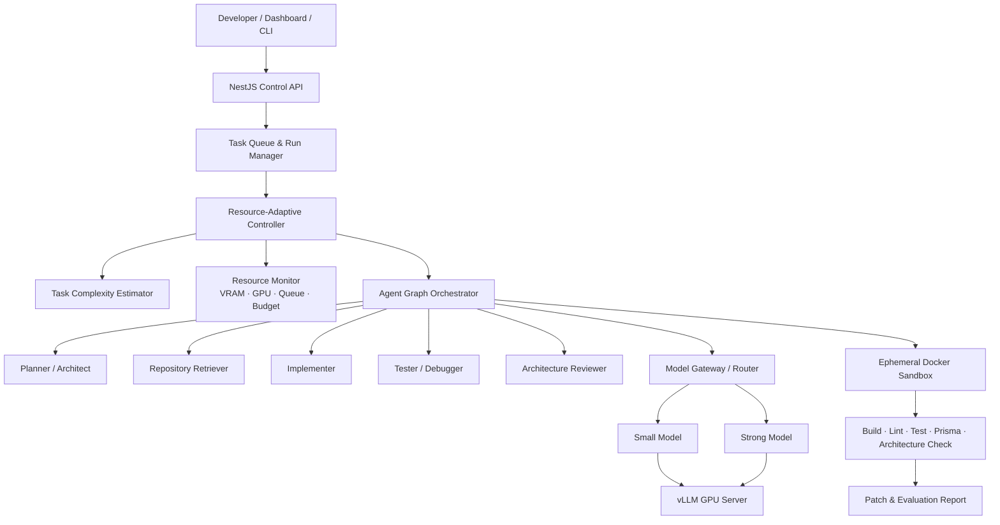

<div align="center">

# Resource-Adaptive Multi-Agent for NestJS

### Hệ thống Multi-Agent tự triển khai, thích nghi theo tài nguyên, hỗ trợ phát triển backend NestJS theo Clean Architecture

<p>
  <a href="#-tổng-quan">Tổng quan</a> •
  <a href="#-kiến-trúc">Kiến trúc</a> •
  <a href="#-công-nghệ-dự-kiến">Công nghệ</a> •
  <a href="#-lộ-trình">Lộ trình</a> •
  <a href="#-nhóm-thực-hiện">Nhóm</a>
</p>

<p>
  
  
  
</p>

</div>

---

## ✨ Tổng quan

Đây là đồ án tốt nghiệp nghiên cứu, thiết kế và đánh giá một hệ thống **Multi-Agent tự triển khai (self-hosted)** dành cho các tác vụ phát triển backend **NestJS** theo nguyên tắc **Clean Architecture**.

Thay vì luôn chạy một cấu hình agent và mô hình duy nhất, hệ thống quan sát độ phức tạp của yêu cầu cùng trạng thái GPU để tự lựa chọn:

- Mô hình phù hợp (nhỏ hoặc mạnh hơn).
- Topology agent phù hợp (single-agent hoặc multi-agent).
- Số vòng phản hồi, ngân sách context và mức độ song song.
- Thời điểm cần nâng cấp mô hình hoặc dừng tác vụ an toàn.

Mục tiêu là tìm được điểm cân bằng tốt hơn giữa **chất lượng bản vá**, **thời gian xử lý**, **mức sử dụng GPU** và **mức độ tuân thủ kiến trúc**.

> **Trạng thái hiện tại:** Đang xây dựng nền tảng, benchmark và các baseline đánh giá.

## 🎯 Mục tiêu nghiên cứu

| Mã | Câu hỏi nghiên cứu |
| --- | --- |
| **RQ1** | Hệ thống Multi-Agent thích nghi tài nguyên có nâng tỷ lệ hoàn thành tác vụ so với Single-Agent dùng model nhỏ không? |
| **RQ2** | Cơ chế thích nghi có giảm chi phí GPU và thời gian xử lý so với Multi-Agent cấu hình cố định không? |
| **RQ3** | Architecture Reviewer có giúp giảm vi phạm Clean Architecture trong mã được sinh ra không? |
| **RQ4** | Đặc trưng nào của tác vụ ảnh hưởng mạnh nhất đến quyết định chọn model và topology agent? |
| **RQ5** | Khi GPU bị giới hạn, chiến lược nào tối đa hoá số tác vụ thành công trên mỗi GPU-hour? |

## 🧩 Phạm vi chức năng

Hệ thống hướng đến năm nhóm tác vụ cho dự án NestJS:

<table>
  <tr>
    <td width="50%"><b>Phát triển tính năng</b><br/>Entity, DTO, use case, repository port/adapter, controller, module wiring và Prisma migration.</td>
    <td width="50%"><b>Sửa lỗi</b><br/>Đọc issue, truy vết nguyên nhân, tạo patch, chạy test và sửa lỗi theo phản hồi.</td>
  </tr>
  <tr>
    <td><b>Refactor Clean Architecture</b><br/>Tách business logic, đảo chiều dependency và chuẩn hoá ranh giới layer.</td>
    <td><b>Sinh &amp; sửa test</b><br/>Unit test cho use case, integration test repository và E2E test API.</td>
  </tr>
  <tr>
    <td colspan="2"><b>Review kiến trúc &amp; chất lượng</b><br/>Phát hiện dependency sai tầng, repository abstraction không đúng, module/provider wiring thiếu và các lỗi kiến trúc có bằng chứng cụ thể.</td>
  </tr>
</table>

## 🏗️ Kiến trúc đề xuất



### Hồ sơ vận hành

| Profile | Luồng agent | Mục đích |
| --- | --- | --- |
| `ECONOMY` | Implementer → Test | DTO, mapping, CRUD đơn giản. |
| `BALANCED` | Planner → Implementer → Test | Tác vụ mức trung bình, có thể escalation. |
| `QUALITY` | Planner → Implementer → Test → Reviewer | Refactor, transaction, migration và thay đổi phức tạp. |
| `RECOVERY` | Debugger → Strong Implementer → Reviewer | Build/test thất bại qua nhiều vòng. |

## 🔬 Cách đánh giá

Đồ án so sánh các baseline Single-Agent, Fixed Multi-Agent và hệ thống Adaptive Multi-Agent trên bộ benchmark NestJS Clean Architecture. Các chỉ số chính gồm:

- Tỷ lệ hoàn thành tác vụ và tỷ lệ vượt hidden tests.
- Architecture Compliance Score.
- Latency, GPU-second, peak VRAM và chi phí trên mỗi tác vụ thành công.
- Hiệu quả routing theo độ khó và tình trạng tài nguyên.

Để bảo đảm khả năng tái lập, mỗi lần thử nghiệm sẽ cố định commit mã nguồn, phiên bản model, prompt, Docker image và cấu hình đánh giá.

## 🛠️ Công nghệ dự kiến

<p>
  
  
  
  
  
  
  
  
  
</p>

| Thành phần | Công nghệ dự kiến |
| --- | --- |
| Control plane | NestJS |
| Agent orchestration | LangGraph.js |
| Hàng đợi | Redis + BullMQ |
| Cơ sở dữ liệu | PostgreSQL + Prisma + pgvector |
| Inference tự triển khai | vLLM qua OpenAI-compatible API |
| Mô hình | Qwen2.5-Coder 7B/14B và Qwen3-Coder-30B-A3B |
| Sandbox & kiểm thử | Docker, TypeScript, ESLint, Jest, Supertest, Prisma |
| Monitoring | Prometheus, Grafana, NVIDIA SMI/DCGM |

## 🗺️ Lộ trình

- [x] Xác định bài toán, phạm vi và câu hỏi nghiên cứu.
- [x] Thiết kế kiến trúc hệ thống và vai trò agent.
- [ ] Xây dựng môi trường inference tự triển khai và Docker sandbox.
- [ ] Xây dựng NestCleanBench cùng evaluation harness.
- [ ] Hoàn thiện Single-Agent và Fixed Multi-Agent baselines.
- [ ] Triển khai Resource-Adaptive Controller theo rule-based routing.
- [ ] Thực nghiệm, phân tích kết quả và hoàn thiện luận văn.

Chi tiết kế hoạch được lưu tại [plan/FirstPlan.md](plan/FirstPlan.md).

## 📁 Cấu trúc repository

```text
.
├── plan/                 # Kế hoạch, phạm vi và định hướng nghiên cứu
└── README.md             # Giới thiệu dự án
```

> Cấu trúc source, benchmark, hạ tầng và tài liệu triển khai sẽ được bổ sung theo các mốc lộ trình.

## 👥 Nhóm thực hiện

<div align="center">
  <table>
    <tr>
      <td align="center" width="220">
        <a href="https://github.com/Minhduc7904">
          
          <br /><sub><b>Nguyễn Minh Đức</b></sub>
        </a>
        <br /><sub>Thành viên thực hiện</sub>
      </td>
      <td align="center" width="220">
        <a href="https://github.com/b4schh">
          
          <br /><sub><b>Mai Khoa Bách</b></sub>
        </a>
        <br /><sub>Thành viên thực hiện</sub>
      </td>
    </tr>
  </table>
</div>

## 📌 Lưu ý

Dự án được xây dựng cho mục đích học thuật và nghiên cứu. Các kết quả benchmark, chỉ số hiệu năng và kết luận chỉ được công bố sau khi hoàn thành quy trình thực nghiệm có thể tái lập.

<div align="center">
  <sub>Made for a graduation thesis · Self-hosted · Resource-aware · Architecture-conscious</sub>
</div>
