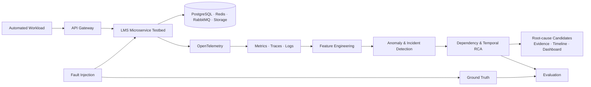

<div align="center">

# AIOps RCA for Microservices

### Phát hiện bất thường và hỗ trợ phân tích nguyên nhân sự cố từ dữ liệu observability và học máy

<p>
  <a href="#-tổng-quan">Tổng quan</a> •
  <a href="#-kiến-trúc">Kiến trúc</a> •
  <a href="#-phạm-vi">Phạm vi</a> •
  <a href="#-tài-liệu">Tài liệu</a> •
  <a href="#-nhóm-thực-hiện">Nhóm</a>
</p>

<p>
  
  
  
</p>

</div>

---

## ✨ Tổng quan

Đây là đồ án tốt nghiệp về hệ thống hỗ trợ **developer/SRE phát hiện hành vi bất thường** và **xếp hạng ứng viên nguyên nhân gốc** (*Root Cause Analysis – RCA*) trong kiến trúc microservice, dựa trên dữ liệu observability và học máy.

Hệ thống LMS thu gọn đóng vai trò **microservice testbed / System Under Test**. Testbed tạo workload, telemetry, fault propagation và ground truth có kiểm soát để đánh giá khách quan pipeline AI/RCA — không phải một sản phẩm LMS hoàn chỉnh.

> **Trạng thái hiện tại:** Hoàn thiện định hướng kỹ thuật, kiến trúc testbed và kế hoạch thực nghiệm.

## 🎯 Mục tiêu

| Mục tiêu | Kết quả hướng đến |
| --- | --- |
| **Microservice testbed** | LMS thu gọn có giao tiếp đồng bộ/bất đồng bộ và dependency thực tế. |
| **Observability** | Thu thập metrics, distributed traces và structured logs với OpenTelemetry. |
| **Anomaly detection** | Nhận diện hành vi bất thường/incident từ dữ liệu telemetry. |
| **Root cause analysis** | Xếp hạng root-cause candidates từ dependency graph và thứ tự lan truyền bất thường. |
| **Đánh giá có cơ sở** | Fault injection, workload tự động và ground truth để đo định lượng. |

## 🏗️ Kiến trúc



### Luồng phân tích

```text
Metrics + Traces + Logs
          ↓
Feature engineering theo service và cửa sổ thời gian
          ↓
Anomaly detection → Incident detection
          ↓
Dependency graph + temporal propagation analysis
          ↓
Root-cause candidate ranking + evidence + incident timeline
```

## 🧩 Phạm vi

### LMS Microservice Testbed

Các service dự kiến gồm **API Gateway, Auth, Course, Enrollment, Assignment, Submission, Grading** và **Notification**. Hệ thống sử dụng PostgreSQL, Redis, RabbitMQ và object storage/storage mock để tạo nhiều loại dependency và failure mode.

Các luồng nghiệp vụ trọng tâm là đăng nhập, xem khóa học, đăng ký học, tạo/nộp bài tập, chấm điểm và gửi thông báo.

### Không thuộc MVP

Chat realtime, forum, video streaming, AI tutor, recommendation, payment và mobile app không thuộc phạm vi vì không trực tiếp đóng góp cho bài toán observability, anomaly detection hoặc RCA.

## 🔬 Hướng đánh giá

| Hạng mục | Cách đánh giá |
| --- | --- |
| **Fault scenarios** | Service error/crash, dependency delay, database latency, cache slowdown, CPU saturation, queue backlog. |
| **Anomaly/incident detection** | Precision, Recall, F1-score, Detection Delay. |
| **RCA ranking** | Top-1, Top-3, Mean Reciprocal Rank (MRR). |
| **So sánh & ablation** | Metrics-only so với metrics + traces; RCA có/không có dependency graph và temporal information. |
| **Độ bền** | Runtime, chi phí tài nguyên và khả năng hoạt động khi telemetry thiếu hoặc sampling giảm. |

## 🛠️ Công nghệ định hướng

<p>
  
  
  
  
  
  
  
  
</p>

| Thành phần | Hướng triển khai |
| --- | --- |
| Testbed | LMS microservices chạy bằng Docker Compose. |
| Telemetry | OpenTelemetry Collector, Prometheus, Grafana Tempo và Loki. |
| Phân tích | Feature engineering, statistical baselines, Isolation Forest, dependency/temporal ranking. |
| Thực nghiệm | Automated workload, fault injection và ground-truth dataset. |

## 📚 Tài liệu

| Nhóm | Nội dung |
| --- | --- |
| [Mô tả đề tài](docs/description/Mô%20tả%20đề%20tài%20ĐATN_260811_125322.pdf) | Phạm vi và mục tiêu chính thức của đồ án. |
| [Định hướng tổng thể](docs/direction/khung_dinh_huong_tong_the_lms_microservice_ai_rca.md) | Khung kỹ thuật, kiến trúc, hướng AI/ML, RCA và đánh giá. |
| [Kiến trúc backend testbed](docs/architecture/dinh_huong_backend_microservice_testbed_lms.md) | Phạm vi LMS, service topology, workload và fault scenarios. |
| [First Plan — 20 tuần](docs/plan/FirstPlan.md) | Lộ trình theo tuần, mốc bàn giao, phối hợp hai thành viên và quản lý rủi ro. |

## 👥 Nhóm thực hiện

<div align="center">
  <table>
    <tr>
      <td align="center" width="220">
        <a href="https://github.com/Minhduc7904">
          
          <br /><sub><b>Nguyễn Minh Đức</b></sub>
        </a>
        <br /><sub>Thành viên thực hiện</sub>
      </td>
      <td align="center" width="220">
        <a href="https://github.com/b4schh">
          
          <br /><sub><b>Mai Khoa Bách</b></sub>
        </a>
        <br /><sub>Thành viên thực hiện</sub>
      </td>
    </tr>
  </table>
</div>

## 📌 Lưu ý

Dự án phục vụ mục đích học thuật. Kết quả benchmark và kết luận sẽ được công bố sau khi hoàn tất quy trình thực nghiệm có thể tái lập.

<div align="center">
  <sub>Made for a graduation thesis · Observable · Measurable · Evidence-driven</sub>
</div>
