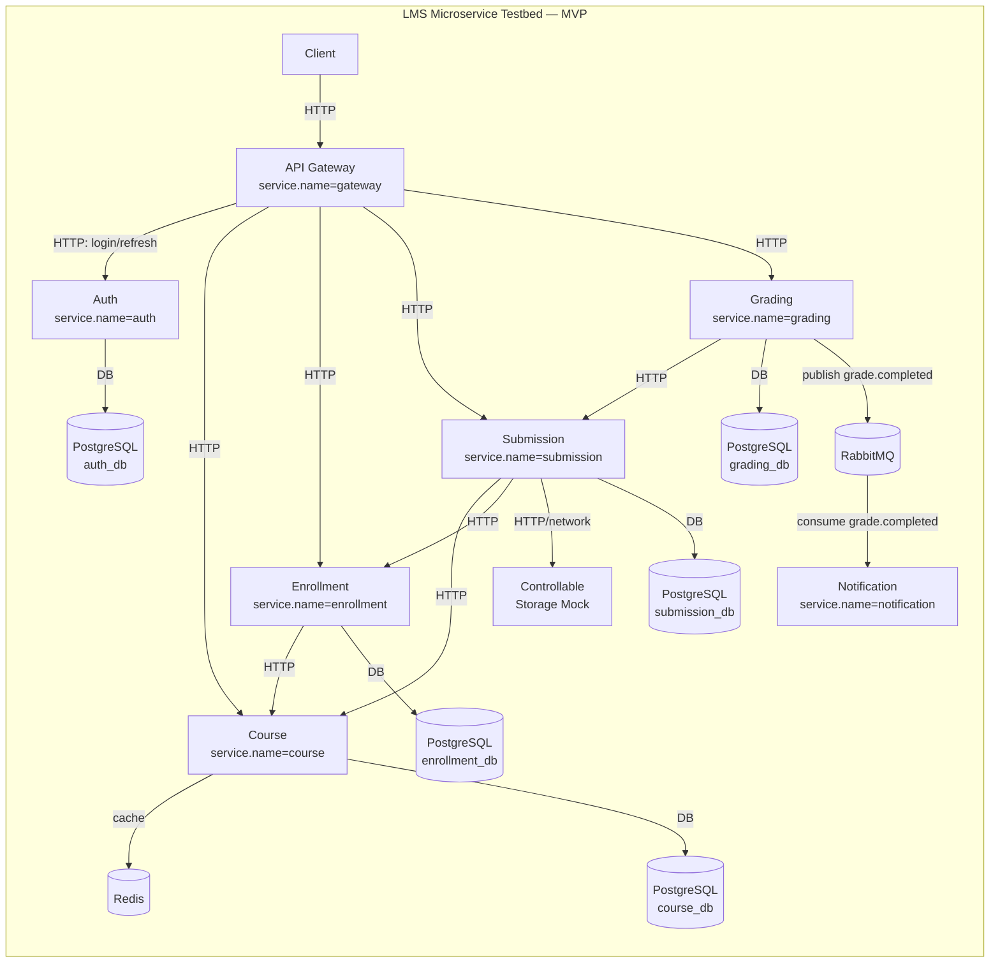
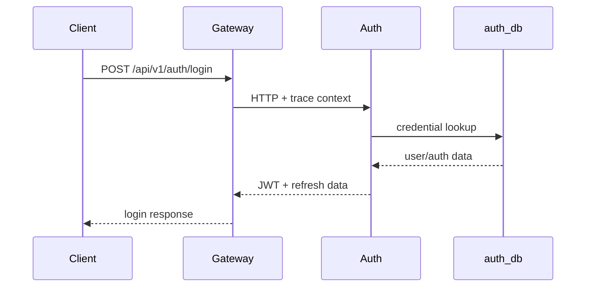
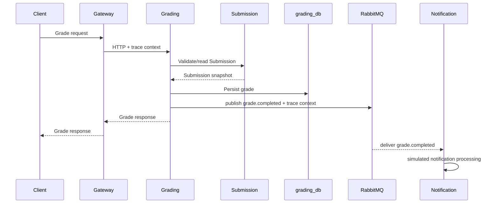

# Service catalogue and topology v1

> **Task:** `task-01_define-service-topology`
>
> **Trạng thái:** Đã finalization trên branch task — nội dung kỹ thuật đã chốt theo source canonical; Bách đã gửi verdict `APPROVED` trên GitHub.
>
> **Vị trí canonical khi đưa vào repository:** `docs/processed/architecture/service-catalogue-and-topology-v1.md`
>
> **Mục đích:** chốt service catalogue, dependency graph và architecture diagram của LMS microservice testbed MVP trước khi scaffold repository/Compose ở tuần 5.

## 1. Source of truth và ranh giới tài liệu

Artifact này không định nghĩa lại scope nghiên cứu hoặc kiến trúc canonical. Khi có mâu thuẫn, ưu tiên:

1. `../direction/khung_dinh_huong_tong_the_lms_microservice_ai_rca.md` — WHY/WHAT và research scope.
2. `backend_microservice_testbed_blueprint.md` — topology, backend implementation architecture và integration convention.
3. `analysis-anomaly-rca-blueprint.md` — cách Analysis dùng service catalogue, telemetry và graph.
4. `../direction/project-scope-v1.md` — MVP/Target/Stretch/out-of-scope đã freeze ở tuần 3.
5. `../direction/research-questions-and-metrics-v1.md` — RQ/metrics.
6. `../plan/implementation-backlog-v1.md` và `../plan/plan-v0.2-24-weeks.md` — dependency/timeline.

### Không thuộc task này

- Không thêm Assignment vào MVP.
- Không thay Storage Mock bằng MinIO.
- Không thêm Kubernetes, service mesh hoặc Chaos Mesh.
- Không scaffold NestJS/Compose.
- Không chốt fault injector chi tiết.
- Không coi architecture diagram tĩnh là dynamic graph dùng trực tiếp cho RCA.

---

# 2. Quyết định topology v1

MVP giữ nguyên **6 business service + 1 API Gateway**:

```text
Gateway
Auth
Course
Enrollment
Submission
Grading
Notification
```

Các dependency hạ tầng bắt buộc:

```text
PostgreSQL
Redis
RabbitMQ
Controllable external Storage Mock
```

Các workflow canonical:

```text
W1 Login              Client -> Gateway -> Auth -> auth_db -> JWT
W2 Browse Course      Client -> Gateway -> Course -> Redis/PostgreSQL
W3 Enroll Course      Client -> Gateway -> Enrollment -> Course + enrollment_db
W4 Submit Course Work Client -> Gateway -> Submission -> Course + Enrollment
                                                   -> Storage Mock + submission_db
W5 Grade and Notify   Client -> Gateway -> Grading -> Submission + grading_db
                                                   -> RabbitMQ -> Notification
```

### Quyết định identity cho service catalogue

Các giá trị `service.name` canonical của MVP:

```text
gateway
auth
course
enrollment
submission
grading
notification
```

Dependency identity canonical dùng cho evidence/telemetry:

```text
auth-postgres
course-postgres
course-redis
enrollment-postgres
submission-postgres
submission-storage
grading-postgres
grading-rabbitmq
notification-rabbitmq
```

`service.name` là identity ổn định cho service. Container/pod/process name không được dùng thay `service.name`.

---

# 3. Architecture diagram v1

## 3.1. Diagram tổng thể



### Diễn giải quan trọng

- Sau login, Gateway **validate JWT cục bộ**; Auth không phải remote dependency của mọi business request.
- Service-to-service HTTP đi trực tiếp tới service owner, không vòng ngược qua Gateway.
- `Grading -> Notification` là **logical async service edge**, thực tế transport đi qua RabbitMQ.
- PostgreSQL, Redis, RabbitMQ và Storage Mock là dependency/component evidence. Chúng không mặc định nằm trong service-level RCA candidate set.
- Telemetry export tới OTel Collector không được xem là business dependency trong graph này; nếu vẽ chung sẽ dễ làm nhiễu graph phục vụ RCA.

---

# 4. Service catalogue MVP

| Component | `service.name` | Trách nhiệm MVP | Data/resource ownership | Inbound dependency | Outbound dependency | Giá trị fault/telemetry/RCA |
| --- | --- | --- | --- | --- | --- | --- |
| **API Gateway** | `gateway` | Entry point; route; validate JWT locally; normalize error; propagate trace context | Không sở hữu business DB | Client | Auth, Course, Enrollment, Submission, Grading qua HTTP | Điểm quan sát symptom upstream; giúp thấy propagation nhưng không mặc định là root-cause candidate |
| **Auth** | `auth` | Login/refresh; phát JWT; role/claim tối thiểu | `auth_db` | Gateway | PostgreSQL `auth_db` | Tạo W1; fault Auth chỉ ảnh hưởng login/refresh theo scope hiện tại |
| **Course** | `course` | Create/get/list course tối thiểu; cache course | `course_db`; sở hữu semantic của cache Course trong Redis | Gateway; Enrollment; Submission | Redis; PostgreSQL `course_db` | F1 Course/Redis latency; cache/database evidence; synchronous edge target |
| **Enrollment** | `enrollment` | Enroll và kiểm tra enrollment | `enrollment_db` | Gateway; Submission | Course qua HTTP; PostgreSQL `enrollment_db` | Tạo propagation edge `submission -> enrollment` và `enrollment -> course` |
| **Submission** | `submission` | Nhận/truy vấn bài nộp; validate Course/Enrollment; lưu content qua Storage Mock | `submission_db`; sở hữu object reference, không sở hữu storage engine | Gateway; Grading | Course; Enrollment; Storage Mock; PostgreSQL `submission_db` | Trọng tâm synchronous propagation; F2, F3, F5 |
| **Grading** | `grading` | Tạo grade tối thiểu; kiểm tra Submission; publish `grade.completed` | `grading_db` | Gateway | Submission; PostgreSQL `grading_db`; RabbitMQ publish | Nối synchronous flow với async flow; producer của event canonical |
| **Notification** | `notification` | Consume `grade.completed`; giả lập notification processing | Không bắt buộc DB trong MVP | RabbitMQ consume | Không có business dependency bắt buộc | F4 consumer slowdown/RabbitMQ backlog; async root-cause candidate theo scenario |

### Ownership rules

1. Mỗi service chỉ truy cập database do chính nó sở hữu.
2. Shared PostgreSQL instance có thể chứa nhiều logical DB nhưng **không cho phép cross-service DB access**.
3. Redis trong MVP phục vụ Course; service khác không đọc trực tiếp cache của Course.
4. Submission chỉ giữ storage object reference/metadata cần thiết; Storage Mock là external dependency riêng.
5. Notification không được đọc trực tiếp `grading_db` hoặc `submission_db` để bù dữ liệu event.
6. Shared package chỉ chứa technical primitive; không chia sẻ entity/repository/controller xuyên service.

---

# 5. Dependency graph v1

## 5.1. Service-to-service graph

Các edge service-level thiết kế:

```text
gateway -> auth
gateway -> course
gateway -> enrollment
gateway -> submission
gateway -> grading

enrollment -> course

submission -> course
submission -> enrollment

grading -> submission
grading -> notification    # async logical edge qua grade.completed
```

`gateway -> notification` **không tồn tại** trong MVP.

`auth -> business-service` sau login **không tồn tại**; JWT được Gateway validate locally.

## 5.2. Component/dependency graph

```text
auth       -> auth-postgres

course     -> course-redis
course     -> course-postgres

enrollment -> enrollment-postgres

submission -> submission-postgres
submission -> submission-storage

grading    -> grading-postgres
grading    -> grading-rabbitmq

notification <- notification-rabbitmq
```

RabbitMQ nối producer/consumer:

```text
grading
  -> grading-rabbitmq
  -> notification-rabbitmq
  -> notification
```

Trong dynamic service graph phục vụ RCA, quan hệ trên được biểu diễn logic thành:

```text
grading -> notification
event = grade.completed
```

---

# 6. Edge catalogue phục vụ telemetry/graph/RCA

| Edge ID | Caller | Callee/dependency | Kiểu | Workflow | Boundary cần quan sát | Identity/evidence tối thiểu |
| --- | --- | --- | --- | --- | --- | --- |
| `e01` | Client | Gateway | HTTP sync | W1–W5 | inbound server span tại Gateway | route, method, status, duration |
| `e02` | Gateway | Auth | HTTP sync | W1 | outbound/inbound HTTP spans | caller=`gateway`, callee=`auth` |
| `e03` | Gateway | Course | HTTP sync | W2 | outbound/inbound HTTP spans | caller=`gateway`, callee=`course` |
| `e04` | Gateway | Enrollment | HTTP sync | W3 | outbound/inbound HTTP spans | caller=`gateway`, callee=`enrollment` |
| `e05` | Gateway | Submission | HTTP sync | W4 | outbound/inbound HTTP spans | caller=`gateway`, callee=`submission` |
| `e06` | Gateway | Grading | HTTP sync | W5 | outbound/inbound HTTP spans | caller=`gateway`, callee=`grading` |
| `e07` | Enrollment | Course | HTTP sync | W3 | client/server spans | caller=`enrollment`, callee=`course` |
| `e08` | Submission | Course | HTTP sync | W4 | client/server spans | caller=`submission`, callee=`course` |
| `e09` | Submission | Enrollment | HTTP sync | W4 | client/server spans | caller=`submission`, callee=`enrollment` |
| `e10` | Submission | Storage Mock | dependency sync | W4 | dependency span + rate/error/duration | `dependency_identity=submission-storage` |
| `e11` | Grading | Submission | HTTP sync | W5 | client/server spans | caller=`grading`, callee=`submission` |
| `e12` | Grading | Notification | async logical | W5 | publish + consume/process spans; message trace context | `event=grade.completed`, `event_id`, producer/consumer |
| `e13` | Auth | PostgreSQL | DB | W1 | DB span + dependency metrics | `auth-postgres` |
| `e14` | Course | Redis | cache | W2/W3/W4 | Redis span + dependency metrics | `course-redis` |
| `e15` | Course | PostgreSQL | DB | W2/W3/W4 | DB span + dependency metrics | `course-postgres` |
| `e16` | Enrollment | PostgreSQL | DB | W3/W4 | DB span + dependency metrics | `enrollment-postgres` |
| `e17` | Submission | PostgreSQL | DB | W4/W5 | DB span + dependency metrics | `submission-postgres` |
| `e18` | Grading | PostgreSQL | DB | W5 | DB span + dependency metrics | `grading-postgres` |
| `e19` | Grading | RabbitMQ | messaging | W5 | publish span + broker metrics | `grading-rabbitmq` |
| `e20` | RabbitMQ | Notification | messaging | W5 | consume/process span + queue/lag | `notification-rabbitmq` |

### Edge observability rule

Khi boundary tồn tại, phải thu được tối thiểu:

```text
caller/service identity
callee/dependency identity
operation
start/end/duration
status/error
timeout semantics nếu có
trace_id/span_id/parent relation cho traces
```

Không dùng `trace_id`, `span_id`, user ID hoặc request ID làm Prometheus label.

---

# 7. Workflow view

## W1 — Login



Sau W1:

```text
Client -> Gateway validate JWT locally -> business service
```

Không có `Gateway -> Auth` token introspection cho mọi request.

## W2 — Browse Course

```text
Client -> Gateway -> Course -> Redis
                           \-> course_db on miss/required query
```

## W3 — Enroll

```text
Client -> Gateway -> Enrollment -> Course
                               \-> enrollment_db
```

## W4 — Submit

```text
Client -> Gateway -> Submission
                       ├-> Course
                       ├-> Enrollment
                       ├-> Storage Mock
                       └-> submission_db
```

## W5 — Grade and Notify



---

# 8. Quan hệ với dynamic dependency graph của Analysis

Architecture graph trong artifact này là **design-time expected topology**.

Analysis phải xây:

```text
G(W) = (V, E)
```

từ telemetry thực tế theo `run/window`, chủ yếu từ distributed traces.

Quy tắc:

1. Design topology dùng để **validate** graph quan sát, không thay thế graph quan sát.
2. Missing edge trong traces phải được ghi nhận như coverage/data-quality issue; không tự điền edge mà không đánh dấu.
3. Async edge `grading -> notification` ưu tiên nối từ RabbitMQ trace context; fallback event ID/time correlation chỉ khi cần và phải giảm confidence.
4. Redis/PostgreSQL/Storage/RabbitMQ có thể xuất hiện trong evidence graph nhưng không trộn vào service-level Top-K candidate set.
5. Candidate set chính thức được freeze trong evaluation protocol. Theo Analysis blueprint, mặc định là business services có thể là fault target.
6. Gateway chỉ là RCA candidate nếu evaluation protocol có gateway fault; với fault matrix MVP hiện tại Gateway chủ yếu là affected symptom.

---

# 9. Mapping topology tới fault MVP

| Fault | Root-cause service | Component/evidence | Edge/node quan trọng |
| --- | --- | --- | --- |
| F1 Course / Redis latency | `course` | `course-redis` | `course -> Redis`; propagation tới Gateway/Enrollment/Submission tùy workload |
| F2 Submission -> Storage latency | `submission` | `submission-storage` | `submission -> Storage Mock`; upstream symptom tại Gateway |
| F3 Submission service error | `submission` | `submission-service` | `gateway -> submission`; có thể ảnh hưởng `grading -> submission` |
| F4 Notification consumer slowdown / RabbitMQ backlog | `notification` | `notification-consumer` | `grading -> RabbitMQ -> notification`; queue depth/consumer processing |
| F5 Submission CPU pressure | `submission` | `submission-instance` | node `submission`; latency/error/resource signal và propagation |

Topology không cần fault trên mọi service. Năm scenario trên đủ năm category canonical của MVP.

---

# 10. Scope consistency

## MVP — có trong topology v1

- Gateway.
- Auth.
- Course.
- Enrollment.
- Submission.
- Grading.
- Notification.
- PostgreSQL logical DB theo owner.
- Redis cho Course.
- RabbitMQ cho `grade.completed`.
- Controllable external Storage Mock.
- HTTP synchronous flow + một async flow rõ ràng.

## Target — không đưa vào topology MVP

- Assignment.
- `assignment_db`.
- MinIO.
- richer component evidence/fault variants khi MVP ổn định.

## Stretch — không đưa vào topology MVP

- Kubernetes/Chaos Mesh.
- Service mesh.
- multi-fault.
- component/instance-level RCA primary.
- resilience architecture nâng cao.

Không thay đổi danh sách trên nếu chưa có ADR và không có bằng chứng trực tiếp rằng topology canonical không đáp ứng research/evaluation.

---

# 11. Quy tắc thay đổi topology

Một thay đổi topology là **breaking architectural change** khi:

- thêm/xóa business service;
- đổi ownership DB/cache/queue/storage;
- thêm event hoặc đổi producer/consumer;
- đổi synchronous thành asynchronous hoặc ngược lại;
- thêm cross-service dependency;
- đổi service identity canonical;
- đưa infrastructure component vào RCA candidate set.

Thay đổi loại này phải:

1. có ADR;
2. cập nhật service catalogue;
3. cập nhật HTTP/event contract nếu liên quan;
4. cập nhật telemetry/ground-truth/evaluation protocol nếu ảnh hưởng graph/RCA;
5. cập nhật fault matrix nếu ảnh hưởng propagation.

---

# 12. Definition of Done check — task-01

| DoD | Bằng chứng | Trạng thái |
| --- | --- | --- |
| Catalogue nêu trách nhiệm, owner dữ liệu và inbound/outbound dependency cho 6 business service + Gateway | Mục 4 | **Đạt về nội dung** |
| Diagram thể hiện HTTP flow, `Grading -> grade.completed -> Notification` và PostgreSQL/Redis/RabbitMQ/Storage Mock | Mục 3, 7 | **Đạt về nội dung** |
| Scope MVP/Target/Stretch nhất quán Backend blueprint | Mục 10 | **Đạt về nội dung** |
| Bách review node/edge cần quan sát và phản hồi được ghi | Mục 13 | **Đạt — Bách verdict `APPROVED` trên GitHub** |

---

# 13. Collaborator review record — Bách

> Bách đã review boundary phục vụ telemetry, graph và RCA, đồng thời gửi verdict trên GitHub.

**Review status:** `APPROVED`

Bách đã xác nhận:

- [x] `service.name` và dependency identity đủ ổn định cho telemetry/feature.
- [x] Service-level edge `e02–e12` đủ để dựng dynamic graph cho W1–W5.
- [x] `grading -> notification` có thể nối bằng RabbitMQ trace context/event identity.
- [x] Component dependency không bị trộn vào service-level candidate set.
- [x] Gateway được xem là symptom mặc định, không tự động là candidate khi không có gateway fault.
- [x] Topology đủ cho RQ2/RQ3 và fault F1–F5.
- [x] Không thiếu edge cần cho feature `caller -> callee`, latency/error propagation hoặc evidence.
- [x] Không có Target/Stretch bị đưa vào MVP.

| Trường | Giá trị |
| --- | --- |
| Reviewer | Bách (`bachmk`) |
| Verdict | `APPROVED` |
| Ngày review | 28/08/2026 |
| Blocking feedback | Không có |
| Non-blocking feedback | Không có |
| Resolution | Không cần sửa substantive artifact. |
| Tồn đọng | Không có |

---

# 14. Kết luận

Topology v1 được freeze ở mức:

```text
6 business services + Gateway
+ PostgreSQL
+ Redis
+ RabbitMQ
+ controllable external Storage Mock
+ synchronous HTTP edges
+ grade.completed async edge
```

Nó đủ tạo dependency, fault propagation, multi-source telemetry, dynamic graph và service-level RCA evidence mà không biến LMS testbed thành production LMS.
