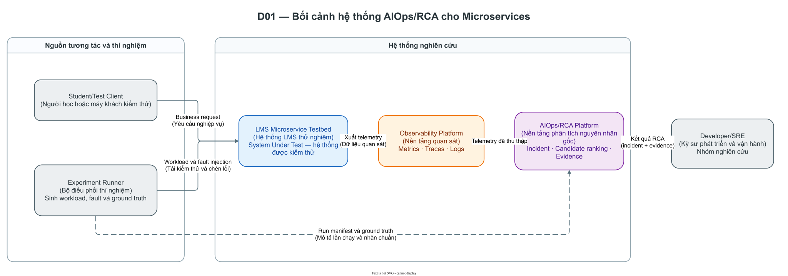
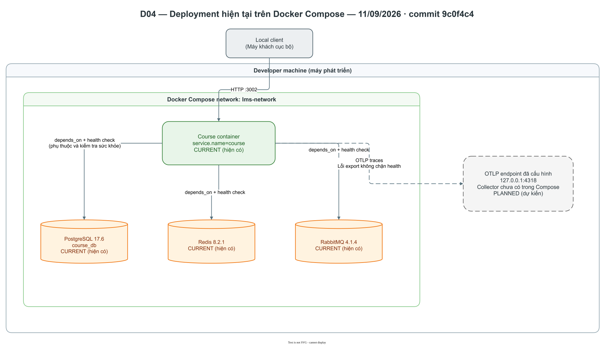
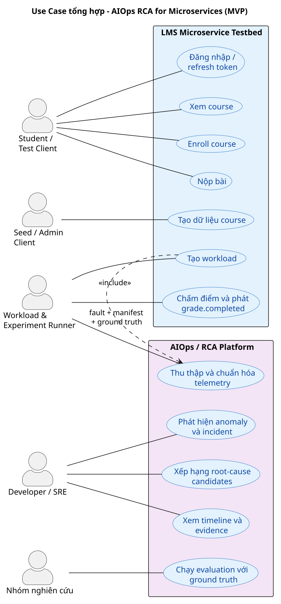
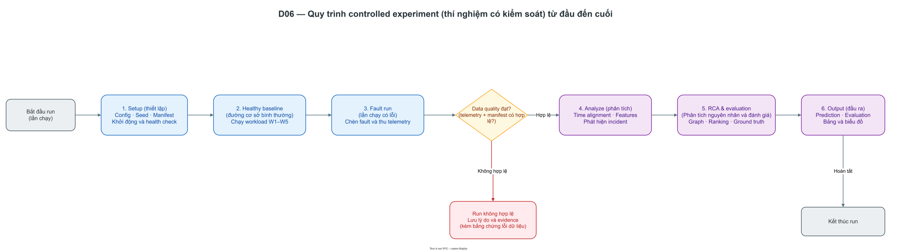
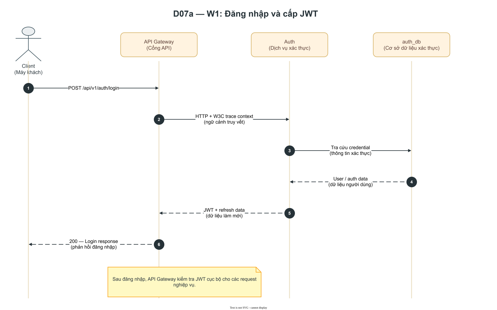
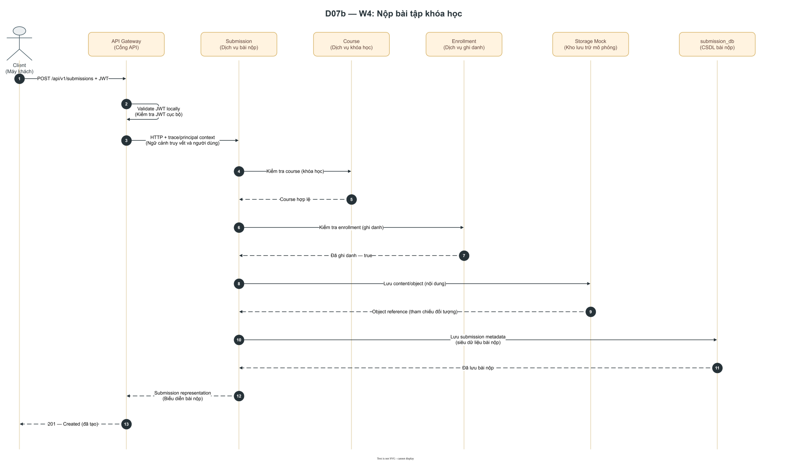
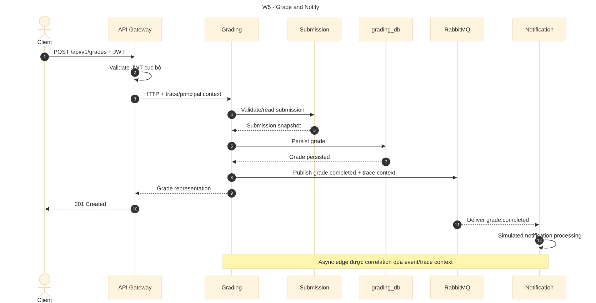
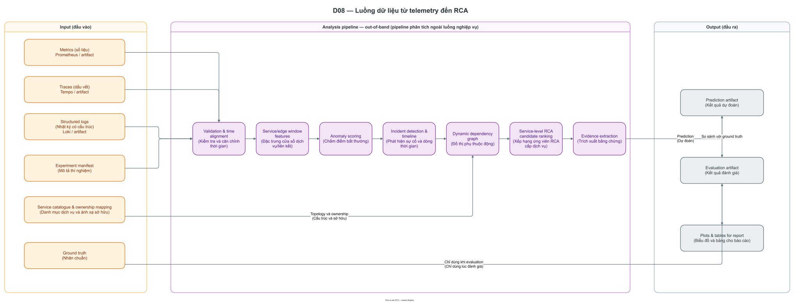

# Bộ sơ đồ hệ thống AIOps RCA for Microservices v1

> **Phạm vi:** bộ sơ đồ trình bày kiến trúc, use case và flow của đồ án ở hai trạng thái: deployment hiện có tại commit `9c0f4c4` ngày 11/09/2026 và kiến trúc MVP mục tiêu. Tài liệu này không thay thế các blueprint canonical.

## 1. Cách đọc

- **Xanh dương:** LMS Microservice Testbed.
- **Cam:** hạ tầng và nguồn telemetry.
- **Tím:** Analysis, anomaly detection và RCA.
- **Xám:** actor, client hoặc output bên ngoài.
- **Xanh lá kèm `CURRENT`:** thành phần có trong Compose hiện tại.
- **Nét đứt kèm `PLANNED`:** thành phần chưa có trong Compose hiện tại.
- Mũi tên liền biểu diễn HTTP hoặc data flow; mũi tên đậm biểu diễn event bất đồng bộ; mũi tên nét đứt biểu diễn telemetry.

Các ảnh SVG/PNG nhúng trong tài liệu được xuất từ nguồn Draw.io cùng tên. File `.drawio` là nguồn chỉnh sửa chính; nguồn Mermaid/PlantUML cũ được giữ lại để truy vết lịch sử, không dùng để ghi đè ảnh nhúng.

Thuật ngữ `root-cause candidate ranking` thể hiện kết quả xếp hạng ứng viên nguyên nhân gốc từ telemetry quan sát được, không được hiểu là bằng chứng nhân quả tuyệt đối.

## 2. Danh mục và khả năng truy vết

| Mã | Sơ đồ | Loại | Nguồn canonical chính | Dùng trong báo cáo | Dùng trong slide |
| --- | --- | --- | --- | --- | --- |
| D01 | System Context | C4 Context | `README.md`; định hướng tổng thể | Chương giới thiệu hệ thống | Có |
| D02 | Kiến trúc tổng quát MVP | C4 Container | Backend blueprint; Analysis/RCA blueprint | Chương thiết kế hệ thống | Có |
| D03 | Service topology LMS | Component/dependency | Service catalogue; HTTP/event contracts | Chương thiết kế backend | Bản rút gọn |
| D04 | Deployment hiện trạng | Deployment | `docker-compose/compose.yaml`; Compose README | Chương hiện thực | Có khi báo cáo tiến độ |
| D05 | Use Case tổng hợp | UML Use Case | HTTP/event contracts; Analysis/RCA blueprint | Chương phân tích yêu cầu | Có |
| D06 | Flow thí nghiệm | UML Activity | Backend blueprint; evaluation protocol | Chương phương pháp thực nghiệm | Có |
| D07a | W1 Login | UML Sequence | Service catalogue; HTTP contracts | Chương thiết kế chi tiết | Không bắt buộc |
| D07b | W4 Submit | UML Sequence | Service catalogue; HTTP contracts | Chương thiết kế chi tiết | Không bắt buộc |
| D07c | W5 Grade and Notify | UML Sequence | Service catalogue; event contract | Chương thiết kế chi tiết | Không bắt buộc |
| D08 | Telemetry đến RCA | Data Flow | Analysis/RCA blueprint | Chương phương pháp đề xuất | Có |

## 3. Các sơ đồ

### D01 — System Context

Sơ đồ giới thiệu hai ranh giới chính: LMS là System Under Test tạo telemetry; AIOps/RCA là phần cung cấp incident, candidate ranking và evidence cho Developer/SRE.



Nguồn Draw.io: [`system-context-v1.drawio`](diagrams/system-context-v1.drawio).

### D02 — Kiến trúc tổng quát MVP

Đây là kiến trúc mục tiêu, không phải mô tả deployment hiện tại. Analysis chạy out-of-band và không tham gia trực tiếp vào business request path.



Nguồn Draw.io: [`mvp-architecture-v1.drawio`](diagrams/mvp-architecture-v1.drawio).

### D03 — Service topology LMS

Sơ đồ thể hiện dependency đồng bộ, database ownership và luồng bất đồng bộ canonical `Grading -> grade.completed -> RabbitMQ -> Notification`. OpenTelemetry không xuất hiện trong graph nghiệp vụ để tránh nhầm telemetry export với business dependency.



Nguồn Draw.io: [`lms-service-topology-v1.drawio`](diagrams/lms-service-topology-v1.drawio).

### D04 — Deployment hiện trạng

Snapshot này chỉ phản ánh baseline Compose ở commit `9c0f4c4`: Course, PostgreSQL, Redis và RabbitMQ. Course đã có cấu hình OTLP traces, nhưng Compose chưa dựng OpenTelemetry Collector.



Nguồn Draw.io: [`current-deployment-v1.drawio`](diagrams/current-deployment-v1.drawio).

### D05 — Use Case tổng hợp

Use case dùng hai system boundary để không biến các thao tác LMS thành mục tiêu chính của đồ án. Actor Student/Test Client tạo nghiệp vụ testbed; Developer/SRE sử dụng output AIOps/RCA. Quan hệ `<<include>>` duy nhất thể hiện một controlled experiment bắt buộc phải thu và chuẩn hóa telemetry.



Nguồn Draw.io: [`system-use-cases-v1.drawio`](diagrams/system-use-cases-v1.drawio).

### D06 — Flow thí nghiệm end-to-end

Nhánh kiểm tra data quality ngăn run thiếu telemetry hoặc manifest được đưa vào đánh giá như một run hợp lệ.



Nguồn Draw.io: [`experiment-flow-v1.drawio`](diagrams/experiment-flow-v1.drawio).

### D07 — Sequence nghiệp vụ

Ba sequence chi tiết hóa các workflow có giá trị lớn nhất cho dependency, fault propagation và trace correlation.

#### D07a — W1 Login



Nguồn Draw.io: [`w1-login-v1.drawio`](diagrams/w1-login-v1.drawio).

#### D07b — W4 Submit



Nguồn Draw.io: [`w4-submit-v1.drawio`](diagrams/w4-submit-v1.drawio).

#### D07c — W5 Grade and Notify



Nguồn Draw.io: [`w5-grade-notify-v1.drawio`](diagrams/w5-grade-notify-v1.drawio).

### D08 — Telemetry đến RCA

Sơ đồ phân biệt input, pipeline và output; ground truth chỉ đi vào evaluation, không được dùng để sinh prediction.



Nguồn Draw.io: [`telemetry-rca-flow-v1.drawio`](diagrams/telemetry-rca-flow-v1.drawio).

## 4. Bộ hình dùng cho slide

Bộ tối thiểu gồm D01, D02, D05, D06 và D08. Khi thời lượng ngắn, dùng D01 để trình bày bài toán, D02 để trình bày giải pháp, D06 để trình bày thực nghiệm và D08 để trình bày phương pháp RCA. D03 và D07 phù hợp với phần hỏi đáp kỹ thuật hoặc phụ lục.

## 5. Quy tắc cập nhật

1. D04 phải được cập nhật ngày/commit khi thành phần Compose thay đổi.
2. D02 và D03 chỉ thay đổi khi tài liệu canonical hoặc ADR thay đổi kiến trúc MVP.
3. API, event name và `service.name` trong sơ đồ phải khớp contract hiện hành.
4. Thành phần chưa triển khai phải có nhãn chữ `PLANNED`; không dùng màu làm dấu hiệu duy nhất.
5. Không đưa Kubernetes, MinIO, Assignment hoặc full LMS frontend vào bộ MVP này.

## 6. Chỉnh sửa và render lại

Mở file `.drawio` cần sửa bằng Draw.io Desktop hoặc [diagrams.net](https://app.diagrams.net/). Bố cục được đặt thủ công theo nội dung; không ép các khối vào kích thước hay lưới cố định. Khi bổ sung thuật ngữ tiếng Anh, ưu tiên kèm diễn giải tiếng Việt trong ngoặc nếu người đọc phổ thông có thể chưa quen.

Từ repository root, render toàn bộ nguồn Draw.io bằng:

```powershell
.\tools\render-drawio-diagrams.ps1
```

Nếu Draw.io Desktop không nằm trong `PATH` hoặc thư mục cài mặc định, truyền rõ executable:

```powershell
.\tools\render-drawio-diagrams.ps1 -DrawioExecutable 'C:\path\to\draw.io.exe'
```

Để chỉ render một số sơ đồ:

```powershell
.\tools\render-drawio-diagrams.ps1 -Names 'system-context-v1', 'mvp-architecture-v1', 'experiment-flow-v1'
```

Script xuất SVG và PNG vào `diagrams/rendered/`, đồng thời nhúng dữ liệu Draw.io vào cả hai định dạng. SVG là bản ưu tiên cho báo cáo và slide vì giữ chữ, đường nét rõ khi phóng to; PNG tỷ lệ 2x là bản dự phòng cho công cụ không hỗ trợ SVG.
